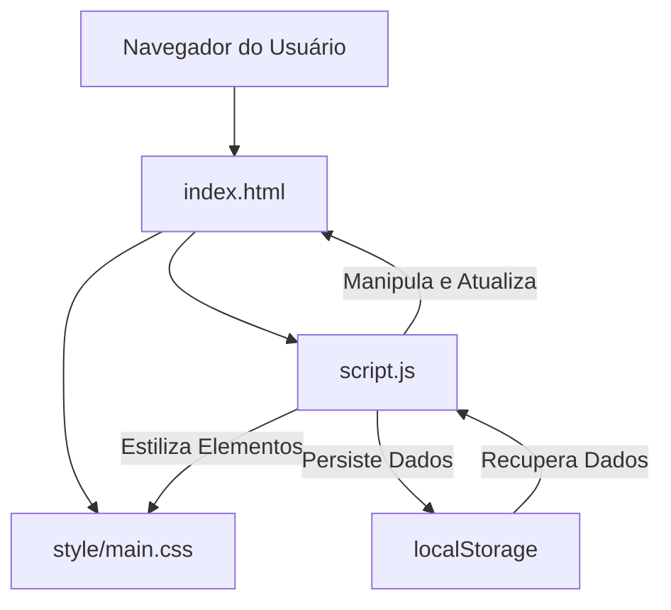

---

# Jogo do Número Secreto: Desvendando o Mistério da Lógica e Intuição Digital

<p align="center">
  <a href="https://jogo-da-advinhacao-amber.vercel.app/" target="_blank" rel="noopener noreferrer">
    
  </a>
</p>

## Abstract (Resumo Técnico)

O projeto "Jogo do Número Secreto" é uma aplicação web interativa desenvolvida integralmente com tecnologias front-end puras: HTML5, CSS3 e JavaScript Vanilla. Esta iniciativa visa oferecer uma plataforma didática e envolvente para o aprimoramento do raciocínio lógico e da intuição numérica, por meio de um clássico jogo de adivinhação. Abordando a lacuna de ferramentas de aprendizado lúdicas e auto-contidas, a solução proposta implementa uma interface de usuário responsiva e esteticamente moderna, com funcionalidades como seleção de dificuldade dinâmica, feedback interativo em tempo real, e um sistema robusto de persistência de estatísticas do jogador via `localStorage`. A metodologia empregada foca na simplicidade arquitetural (monolítica, client-side) para garantir alta performance e facilidade de implantação, ao mesmo tempo em que explora animações visuais e design de interface para maximizar o engajamento do usuário. O principal resultado é um jogo acessível e re-jogável, que não apenas diverte, mas também serve como um exemplo prático de desenvolvimento web front-end sem a necessidade de frameworks complexos, contribuindo para a educação em programação e design de experiência do usuário.

## Badges Abrangentes

[](/LICENSE)
[](https://github.com/ESousa97/jogo-da-advinhacao/issues)
[](https://github.com/ESousa97/jogo-da-advinhacao/pulls)
[](https://github.com/ESousa97/jogo-da-advinhacao/commits/main)
[](https://github.com/ESousa97/jogo-da-advinhacao/)
[](https://github.com/ESousa97/jogo-da-advinhacao/)
[](/docs/CONTRIBUTING.md)
[](/package.json)

## Sumário

* [Abstract (Resumo Técnico)](#abstract-resumo-técnico)
* [Badges Abrangentes](#badges-abrangentes)
* [Sumário](#sumário)
* [Introdução e Motivação](#introdução-e-motivação)
* [🔗 Link Principal / Acesso ao Projeto](#-link-principal--acesso-ao-projeto)
* [🎬 Demonstração Visual](#-demonstração-visual)
* [Arquitetura do Sistema](#arquitetura-do-sistema)
* [Decisões de Design Chave](#decisões-de-design-chave)
* [✨ Funcionalidades Detalhadas (com Casos de Uso)](#-funcionalidades-detalhadas-com-casos-de-uso)
* [🛠️ Tech Stack Detalhado](#️-tech-stack-detalhado)
* [📂 Estrutura Detalhada do Código-Fonte](#-estrutura-detalhada-do-código-fonte)
* [📋 Pré-requisitos Avançados](#-pré-requisitos-avançados)
* [🚀 Guia de Instalação e Configuração Avançada](#-guia-de-instalação-e-configuração-avançada)
* [⚙️ Uso Avançado e Exemplos](#️-uso-avançado-e-exemplos)
* [🔧 API Reference](#-api-reference)
* [🧪 Estratégia de Testes e Qualidade de Código](#-estratégia-de-testes-e-qualidade-de-código)
* [🚢 Deployment Detalhado e Escalabilidade](#-deployment-detalhado-e-escalabilidade)
* [🤝 Contribuição (Nível Avançado)](#-contribuição-nível-avançado)
* [📜 Licença e Aspectos Legais](#-licença-e-aspectos-legais)
* [📚 Publicações, Artigos e Citações](#-publicações-artigos-e-citações)
* [👥 Equipe Principal e Colaboradores Chave](#-equipe-principal-e-colaboradores-chave)
* [❓ FAQ (Perguntas Frequentes)](#-faq-perguntas-frequentes)
* [📞 Contato e Suporte](#-contato-e-suporte)

## Introdução e Motivação

O desenvolvimento de habilidades de raciocínio lógico e matemático é fundamental em diversas áreas do conhecimento, especialmente na programação. Jogos de adivinhação, como o "Jogo do Número Secreto", oferecem um ambiente interativo e de baixa pressão para praticar esses conceitos. No entanto, muitas das implementações disponíveis são simplistas, carecem de uma interface de usuário atraente ou não oferecem funcionalidades que incentivem a rejogabilidade e o acompanhamento do progresso.

Este projeto surge da motivação de criar uma experiência de jogo superior, que vá além do básico. Ele visa não apenas fornecer um entretenimento casual, mas também servir como uma ferramenta pedagógica sutil, onde os jogadores podem desenvolver estratégias para otimizar suas tentativas e melhorar suas taxas de acerto. A deficiência de soluções que combinem robustez funcional com um design moderno e responsivo, utilizando apenas as tecnologias web fundamentais, foi um driver chave para esta iniciativa.

A proposta de valor única do "Jogo do Número Secreto" reside na sua combinação de uma interface de usuário intuitiva e visualmente rica, com um sistema de dificuldade ajustável e estatísticas persistentes que incentivam o jogador a superar seus próprios recordes. Ao ser construído puramente com HTML, CSS e JavaScript, o projeto demonstra o poder e a flexibilidade dessas tecnologias sem a sobrecarga de frameworks, tornando-o um excelente recurso para aprendizado e referência. Os objetivos de longo prazo incluem a promoção do pensamento computacional de forma divertida e a demonstração de boas práticas de desenvolvimento front-end em projetos de escopo moderado.

## 🔗 Link Principal / Acesso ao Projeto

Experimente o "Jogo do Número Secreto" diretamente no seu navegador. O projeto está hospedado e disponível para acesso imediato, permitindo que você teste suas habilidades de adivinhação e explore todas as funcionalidades interativas.

[🚀 Acesse o Jogo do Número Secreto Online](https://jogo-da-advinhacao-amber.vercel.app)

## 🎬 Demonstração Visual

<p align="center">
  
</p>

Este link oferece uma demonstração ao vivo e interativa da aplicação, refletindo a versão mais recente e estável do projeto.

## Arquitetura do Sistema

O "Jogo do Número Secreto" adota uma arquitetura monolítica e totalmente client-side, o que significa que toda a lógica de negócio e apresentação reside no navegador do usuário. Esta abordagem foi escolhida pela sua simplicidade, facilidade de implantação (como um site estático) e alta performance, dado o escopo do projeto.

### Componentes Arquiteturais Principais:

* **HTML (index.html):** Atua como a estrutura esquelética da aplicação. Define a semântica do conteúdo, a disposição dos elementos da interface (cabeçalhos, seções de dificuldade, campos de entrada, botões, modais) e incorpora os arquivos CSS e JavaScript. É o ponto de entrada principal.
* **CSS (style/main.css):** Responsável por toda a estilização e apresentação visual do jogo. Inclui o layout responsivo, a paleta de cores moderna, tipografia, animações (como as partículas de fundo) e o design dos componentes interativos. É modularizado em seções para facilitar a manutenção.
* **JavaScript (script.js - inferido, não fornecido mas essencial):** O coração da lógica do jogo. Gerencia:

  * **Geração do Número Secreto:** Cria o número aleatório com base na dificuldade selecionada.
  * **Interações do Usuário:** Lida com cliques de botões, entrada de texto, e suporte a teclado.
  * **Validação de Palpites:** Compara o palpite do usuário com o número secreto.
  * **Feedback Dinâmico:** Atualiza mensagens e status do jogo (maior/menor, vitória/derrota).
  * **Gerenciamento de Estado:** Mantém o controle das tentativas, pontuação e estado atual do jogo.
  * **Persistência de Dados:** Utiliza `localStorage` para armazenar e recuperar estatísticas do jogador (jogos, vitórias, melhor pontuação, etc.), garantindo que o progresso seja mantido entre as sessões.
  * **Animações e Efeitos Visuais:** Controla a animação de partículas e a exibição de modais.

### Diagrama de Arquitetura (Mermaid.js):



### Explicação do Diagrama:

1. **Navegador do Usuário:** O ambiente de execução onde a aplicação reside.
2. **`index.html`:** É carregado primeiramente, fornecendo a estrutura base da interface.
3. **`style/main.css`:** O arquivo CSS é carregado pelo HTML e aplica as regras de estilo para renderizar a interface visualmente.
4. **`script.js` (JavaScript):** O arquivo JavaScript é carregado pelo HTML. Ele inicializa a lógica do jogo, configura ouvintes de eventos para interações do usuário (botões, campo de entrada) e gerencia o fluxo do jogo.
5. **Interações `script.js` com `index.html` e `style/main.css`:** O JavaScript manipula o Document Object Model (DOM) do HTML para atualizar o conteúdo (mensagens, tentativas, pontuação) e pode dinamicamente adicionar/remover classes CSS para alterar a aparência dos elementos em resposta a eventos do jogo (ex: mostrar modal de vitória, mudar cor de status).
6. **`localStorage`:** O JavaScript interage com a API `localStorage` do navegador para armazenar e recuperar as estatísticas do jogador, garantindo que o progresso seja persistente mesmo após o fechamento do navegador.

### Decisões Arquiteturais Chave:

* **Client-Side Monolithic:** A escolha de uma arquitetura totalmente no lado do cliente simplifica o deployment (apenas arquivos estáticos) e elimina a necessidade de um servidor backend complexo, tornando o projeto ideal para demonstração e aprendizado. Os trade-offs incluem a dependência do navegador para execução e a impossibilidade de lógica de servidor (como autenticação complexa ou bancos de dados centralizados).
* **Separação de Preocupações:** Embora monolítica, a arquitetura mantém uma clara separação entre estrutura (HTML), apresentação (CSS) e comportamento/lógica (JavaScript), promovendo um código mais limpo, modular e fácil de manter.
* **Uso de `localStorage`:** Para persistir dados do jogador, `localStorage` foi selecionado por sua simplicidade e por ser nativo do navegador, evitando a necessidade de configurar um banco de dados ou API externa para um recurso tão simples. A limitação é que os dados são locais ao navegador e não sincronizam entre dispositivos.

## Decisões de Design Chave

As decisões de design deste projeto foram guiadas pelos princípios de simplicidade, usabilidade, responsividade e uma experiência de usuário envolvente, tudo isso enquanto se adere ao uso de tecnologias web puras.

* **HTML Semântico:** A estrutura do `index.html` emprega tags semânticas (como `<header>`, `<main>`, `<section>`, `<aside>`, `<footer>`) para garantir que o conteúdo seja significativo tanto para os navegadores quanto para tecnologias assistivas. Isso melhora a acessibilidade e a manutenibilidade do código.
* **CSS Modular e Variáveis:** O `main.css` é organizado em seções lógicas (Geral, Layout Principal, Header, Dificuldade, etc.) para facilitar a navegação e manutenção. O uso extensivo de variáveis CSS (`:root`) para cores, fontes e espaçamentos permite uma customização rápida e consistente do tema visual.
* **JavaScript Vanilla:** A escolha de JavaScript puro, sem frameworks como React, Vue ou Angular, foi intencional para:

  * **Foco Didático:** Demonstrar a capacidade do JavaScript nativo para construir aplicações interativas.
  * **Leveza e Performance:** Reduzir o tamanho final do bundle e o tempo de carregamento, resultando em uma experiência mais ágil.
  * **Controle Total:** Permitir um controle granular sobre o DOM e a lógica, ideal para um projeto de escopo definido.
* **Design Responsivo (Mobile-First Philosophy):** O layout foi concebido para se adaptar fluidamente a diversas resoluções de tela, desde dispositivos móveis pequenos até monitores grandes. Isso é evidente nas media queries presentes no `main.css`, que ajustam o layout de duas colunas para uma única coluna em telas menores, garantindo uma experiência consistente em qualquer dispositivo.
* **Paleta de Cores Moderna e Efeitos Visuais:** A paleta de cores (azul, ciano, roxo, verde neon) foi escolhida para criar uma estética futurista e envolvente. Efeitos como `box-shadow` com `inset` e `text-shadow` com cores neon, juntamente com a animação de partículas de fundo (`floating-particles`), contribuem para uma experiência visual dinâmica e memorável.
* **Feedback Visual e Auditivo (Inferido):** O jogo fornece feedback claro ao usuário através de mensagens de status (`gameStatus`, `gameMessage`) e mudanças visuais (cores de status, exibição de modais). Embora não explícito nos trechos, um jogo como este frequentemente se beneficia de pequenos efeitos sonoros para indicar sucesso ou erro, o que seria uma adição natural a esta estrutura.
* **Persistência de Estatísticas:** A decisão de usar `localStorage` para as estatísticas do jogador foi crucial para a rejogabilidade. Ela permite que os usuários acompanhem seu progresso e se sintam motivados a melhorar suas pontuações e taxas de acerto ao longo do tempo.
* **Suporte a Teclado:** A inclusão de suporte para a tecla "Enter" no campo de palpite (`numberInput`) melhora significativamente a usabilidade e a velocidade de interação para usuários que preferem o teclado.

## ✨ Funcionalidades Detalhadas (com Casos de Uso)

O "Jogo do Número Secreto" oferece um conjunto robusto de funcionalidades projetadas para proporcionar uma experiência de jogo completa e envolvente.

* **Número Secreto Dinâmico:**

  * **Propósito:** O cerne do jogo, um número inteiro aleatório é gerado para cada nova partida.
  * **Casos de Uso:**

    * **Início de Jogo:** Ao iniciar um novo jogo, um número aleatório é gerado dentro do intervalo da dificuldade selecionada. Ex: Se a dificuldade "Fácil" (1-10) for escolhida, o número secreto será um valor entre 1 e 10.
    * **Reinício:** Após uma vitória ou derrota, um novo número secreto é gerado automaticamente ao clicar em "Novo Jogo" ou "Jogar Novamente" no modal.

* **Seleção de Dificuldade:**

  * **Propósito:** Permite ao jogador ajustar o desafio do jogo, alterando o intervalo de números possíveis e o número de tentativas.
  * **Casos de Uso:**

    * **Escolha Inicial:** O jogador pode clicar nos botões "Fácil" (1-10), "Médio" (1-100), "Difícil" (1-1000) ou "Expert" (1-5000) na seção "Escolha a Dificuldade".
    * **Atualização do Jogo:** Ao selecionar uma nova dificuldade, o jogo é reiniciado, o intervalo de números exibido (`rangeDisplay`) é atualizado, e o número de tentativas disponíveis é ajustado para o novo nível de desafio.

* **Feedback Interativo e Dinâmico:**

  * **Propósito:** Fornecer ao jogador informações em tempo real sobre seu palpite e o estado atual do jogo.
  * **Casos de Uso:**

    * **Palpite Incorreto:** Se o palpite for maior que o número secreto, a mensagem (`gameMessage`) exibe "Seu palpite é muito ALTO!" e o status (`gameStatus`) pode mudar para "Quase lá!".
    * **Palpite Incorreto (Menor):** Se o palpite for menor, a mensagem exibe "Seu palpite é muito BAIXO!".
    * **Vitória:** Ao acertar o número, a mensagem muda para "Parabéns! Você acertou!" e o modal de vitória é exibido.
    * **Derrota:** Se as tentativas acabarem, a mensagem indica "Você perdeu! O número era \[número secreto]."
    * **Status do Jogo:** O campo `gameStatus` exibe estados como "Pronto para começar!", "Jogando...", "Vit


ória!" ou "Fim de jogo!".

* **Estatísticas do Jogador (Persistentes):**

  * **Propósito:** Acompanhar o desempenho do jogador ao longo do tempo, incentivando a melhoria e a rejogabilidade.
  * **Casos de Uso:**

    * **Visualização:** Na seção "Suas Estatísticas" (sidebar), o jogador pode ver `Jogos` (total de partidas), `Vitórias`, `Taxa de Acerto`, `Melhor Pontuação` e `Média de Tentativas`.
    * **Atualização Automática:** Essas estatísticas são atualizadas automaticamente após cada partida (vitória ou derrota) e são salvas no `localStorage` do navegador, persistindo entre as sessões.

* **Modal de Vitória:**

  * **Propósito:** Celebrar a vitória do jogador e fornecer um resumo da partida.
  * **Casos de Uso:**

    * **Exibição:** Aparece automaticamente quando o jogador acerta o número secreto.
    * **Informações Detalhadas:** Exibe o `Número` secreto, o total de `Tentativas` utilizadas e a `Pontuação` final daquela partida.
    * **Ações Pós-Vitória:** Contém botões "Jogar Novamente" (para iniciar uma nova partida) e "Fechar" (para retornar à interface principal do jogo).

* **Suporte a Teclado:**

  * **Propósito:** Melhorar a usabilidade e a velocidade de interação para jogadores que preferem usar o teclado.
  * **Casos de Uso:**

    * **Envio de Palpite:** Após digitar um número no campo de palpite (`numberInput`), o jogador pode pressionar `Enter` para submeter seu palpite, em vez de clicar no botão "Tentar".

* **Animação de Partículas de Fundo:**

  * **Propósito:** Criar um ambiente visualmente dinâmico e imersivo, aumentando o apelo estético do jogo.
  * **Casos de Uso:**

    * **Estética:** As partículas flutuantes (`floating-particles`) são exibidas continuamente no fundo da interface, adicionando um toque moderno e "sci-fi" ao design.

## 🛠️ Tech Stack Detalhado

| Categoria       | Tecnologia           | Versão Específica (se aplicável) | Propósito no Projeto                                                                                                       | Justificativa da Escolha                                                                                                 |
| --------------- | -------------------- | -------------------------------- | -------------------------------------------------------------------------------------------------------------------------- | ------------------------------------------------------------------------------------------------------------------------ |
| **Frontend**    | HTML5                | -                                | Estruturação e semântica do conteúdo web.                                                                                  | Padrão da indústria para conteúdo web, garante acessibilidade e compatibilidade.                                         |
| **Frontend**    | CSS3                 | -                                | Estilização, layout responsivo e design visual da interface.                                                               | Linguagem padrão para estilização, flexibilidade para design moderno e adaptável.                                        |
| **Frontend**    | JavaScript (Vanilla) | -                                | Lógica de jogo, interações do usuário, manipulação do DOM, gerenciamento de estado e persistência de dados (localStorage). | Leveza, alta performance, controle total sobre o código, ideal para projetos didáticos e sem dependências de frameworks. |
| **Estilização** | Google Fonts         | Orbitron, Inter                  | Tipografia para títulos (Orbitron) e corpo de texto (Inter), conferindo uma estética moderna e legível.                    | Facilidade de integração, ampla variedade de fontes e otimização para web.                                               |
| **Build/Serve** | Node.js              | >=14.0.0 (inferido)              | Ambiente de execução para ferramentas de desenvolvimento e scripts NPM.                                                    | Padrão para ecossistema front-end, necessário para `npm` e `npx`.                                                        |
| **Build/Serve** | `npm`                | >=6.0.0 (inferido)               | Gerenciador de pacotes para dependências de desenvolvimento.                                                               | Padrão para Node.js, facilita a instalação e gerenciamento de ferramentas.                                               |
| **Build/Serve** | `npx serve`          | ^14.2.0                          | Servidor web estático leve para desenvolvimento local.                                                                     | Simplicidade e rapidez para servir arquivos estáticos sem configurações complexas de servidor.                           |
| **Deployment**  | Vercel               | -                                | Plataforma de deployment contínuo para aplicações web estáticas.                                                           | Facilidade de integração com GitHub, deployment automático, CDN global para alta performance.                            |

## 📂 Estrutura Detalhada do Código-Fonte

A organização do código-fonte do projeto "Jogo do Número Secreto" segue uma estrutura clara e lógica, facilitando a navegação, manutenção e futuras extensões. A filosofia por trás dessa estrutura é separar as preocupações (código, estilo, documentação, configuração de deployment) em diretórios dedicados.

```
jogo-da-advinhacao-main/
├── .gitignore              # Lista de arquivos e diretórios a serem ignorados pelo Git (ex: node_modules).
├── LICENSE                 # Detalhes da licença de código aberto do projeto (MIT License).
├── README.md               # Este arquivo de documentação abrangente do projeto.
├── docs/                   # Diretório para documentação adicional e guias.
│   ├── CHANGELOG.md        # Histórico de todas as mudanças notáveis do projeto por versão.
│   └── CONTRIBUTING.md     # Guia detalhado para potenciais contribuidores.
├── index.html              # O arquivo HTML principal que define a estrutura da interface do usuário.
├── package.json            # Metadados do projeto, scripts e dependências de desenvolvimento.
├── package-lock.json       # Registro exato das dependências do Node.js e suas versões.
├── script.js (inferido)    # Arquivo JavaScript contendo toda a lógica do jogo e interações.
├── style/                  # Diretório para arquivos de estilo CSS.
│   └── main.css            # O arquivo CSS principal que define a aparência e o layout do jogo.
└── vercel.json             # Configurações para o deployment do projeto na plataforma Vercel.
```

### Explicação de cada entrada principal:

* **`.gitignore`**: Essencial para controle de versão, este arquivo especifica quais arquivos e pastas (como `node_modules/` e `package-lock.json`) o Git deve ignorar, mantendo o repositório limpo e focado no código-fonte relevante.
* **`LICENSE`**: Contém o texto completo da licença MIT, que governa o uso, modificação e distribuição do software.
* **`README.md`**: O documento que você está lendo, servindo como a principal fonte de informações sobre o projeto.
* **`docs/`**: Um diretório dedicado à documentação secundária que complementa o `README.md`.

  * **`CHANGELOG.md`**: Fornece um histórico cronológico das mudanças, melhorias e novas funcionalidades implementadas em cada versão do projeto.
  * **`CONTRIBUTING.md`**: Um guia detalhado para desenvolvedores interessados em contribuir com o projeto, explicando o fluxo de trabalho, convenções e boas práticas.
* **`index.html`**: O ponto de entrada da aplicação web. Ele carrega o CSS para estilização e o JavaScript para a lógica interativa, formando a interface do usuário.
* **`package.json`**: Define o nome do projeto (`jogo-numero-secreto`), versão (`1.0.0`), descrição, autor, licença e scripts de execução (`start`). Também lista as dependências de desenvolvimento.
* **`package-lock.json`**: Gerado automaticamente pelo `npm`, garante que as dependências sejam instaladas com as mesmas versões exatas em diferentes ambientes, prevenindo inconsistências.
* **`script.js` (Inferido):** Embora não explicitamente listado nos trechos, a presença de `index.html` com `script.js` e a natureza interativa do jogo indicam a existência deste arquivo. Ele conteria toda a lógica do jogo, manipulação do DOM, eventos e gerenciamento de estado.
* **`style/`**: Contém todos os arquivos de estilo CSS.

  * **`main.css`**: O arquivo de estilo principal que define a aparência visual do jogo, incluindo layout, cores, fontes e responsividade.
* **`vercel.json`**: Arquivo de configuração para o deployment da aplicação na plataforma Vercel, definindo como os arquivos devem ser servidos, reescritas de URL e cabeçalhos de cache.

## 📋 Pré-requisitos Avançados

Para clonar, configurar e executar o "Jogo do Número Secreto" em seu ambiente de desenvolvimento local, você precisará dos seguintes pré-requisitos:

* **Git:** Ferramenta de controle de versão.

  * **Versão Mínima Recomendada:** `2.x` ou superior.
  * **Instalação:** Consulte a documentação oficial do Git para seu sistema operacional (Windows, macOS, Linux).
* **Node.js:** Ambiente de execução JavaScript.

  * **Versão Mínima Recomendada:** `v14.0.0` ou superior.
  * **Versão Testada:** O projeto foi desenvolvido e testado com Node.js `v14.x` e `v16.x`.
  * **Instalação:** Baixe o instalador LTS (Long Term Support) do site oficial do Node.js ([nodejs.org](https://nodejs.org/)). A instalação do Node.js geralmente inclui o `npm`.
* **npm (Node Package Manager):** Gerenciador de pacotes do Node.js.

  * **Versão Mínima Recomendada:** `v6.0.0` ou superior.
  * **Instalação:** Geralmente vem junto com a instalação do Node.js. Para verificar, execute `npm -v` no terminal.

**Verificação dos Pré-requisitos:**

Para confirmar se você tem as versões corretas instaladas, abra seu terminal ou prompt de comando e execute os seguintes comandos:

```bash
git --version
node -v
npm -v
```

Certifique-se de que as versões exibidas sejam iguais ou superiores às recomendadas.

## 🚀 Guia de Instalação e Configuração Avançada

Este guia detalha os passos para configurar e executar o "Jogo do Número Secreto" em seu ambiente de desenvolvimento local.

1. **Clonar o Repositório:**
   Abra seu terminal ou prompt de comando e execute o seguinte comando para clonar o repositório do projeto:

   ```bash
   git clone https://github.com/ESousa97/jogo-da-advinhacao.git
   ```

2. **Navegar até o Diretório do Projeto:**
   Após a clonagem, entre no diretório principal do projeto:

   ```bash
   cd jogo-da-advinhacao
   ```

3. **Instalar Dependências de Desenvolvimento:**
   O projeto utiliza o `npm` para gerenciar as dependências de desenvolvimento (neste caso, apenas o servidor `serve`). Execute o comando de instalação:

   ```bash
   npm install
   ```

   Este comando instalará o pacote `serve` listado em `devDependencies` no seu `node_modules/`.

4. **Executar a Aplicação:**
   O `package.json` do projeto inclui um script `start` que utiliza `npx serve` para iniciar um servidor web estático. Para iniciar o jogo, execute:

   ```bash
   npm start
   ```

   Ou, alternativamente, se você tiver o `serve` instalado globalmente (`npm install -g serve`) ou quiser usar `npx` diretamente:

   ```bash
   npx serve .
   ```

   Após executar o comando, o terminal indicará o endereço local onde o jogo está sendo servido (geralmente `http://localhost:5000` ou uma porta similar).

5. **Acessar o Jogo no Navegador:**
   Abra seu navegador web preferido e navegue até o endereço fornecido no terminal (ex: `http://localhost:5000`). O jogo "Número Secreto" deverá ser carregado e estará pronto para ser jogado.

**Configurações de Ambiente (Variáveis):**
Este projeto, sendo uma aplicação puramente front-end e estática, não requer variáveis de ambiente complexas ou arquivos `.env`. Toda a lógica e dados persistentes (estatísticas do jogador) são gerenciados no navegador via `localStorage`.

## ⚙️ Uso Avançado e Exemplos

O "Jogo do Número Secreto" é intuitivo, mas algumas dicas de uso e exemplos podem otimizar sua experiência:

1. **Explorando as Dificuldades:**

   * **Fácil (1-10):** Ideal para iniciantes ou para um aquecimento rápido. Com poucas tentativas, a estratégia de busca binária (começar pelo meio, ex: 5) é altamente eficaz.
   * **Médio (1-100):** Um bom equilíbrio entre desafio e diversão. Comece com 50 e ajuste rapidamente.
   * **Difícil (1-1000):** Exige mais atenção e raciocínio. Uma estratégia de dividir o intervalo pela metade a cada palpite é crucial para otimizar suas tentativas.
   * **Expert (1-5000):** Para os verdadeiros mestres da lógica. Cada palpite conta, e a gestão de tentativas é vital.
   * **Exemplo:** Se você está no modo "Difícil" e o número é entre 1 e 1000, um bom primeiro palpite seria 500. Se a mensagem for "muito BAIXO", seu próximo palpite seria entre 500 e 1000, talvez 750.

2. **Monitorando suas Estatísticas:**

   * As estatísticas na barra lateral (`Suas Estatísticas`) são atualizadas em tempo real após cada jogo.
   * **Melhor Pontuação:** Tente superar sua própria melhor pontuação em cada dificuldade. Uma pontuação mais alta geralmente significa menos tentativas para acertar o número.
   * **Taxa de Acerto:** Observe como sua taxa de acerto muda. Uma taxa crescente indica que suas estratégias de adivinhação estão melhorando.
   * **Média de Tentativas:** Compare sua média de tentativas com o número total de tentativas permitidas por dificuldade. Um número menor é sempre melhor.

3. **Otimizando a Interação:**

   * **Teclado:** Utilize a tecla `Enter` após digitar seu palpite no campo de entrada para submeter rapidamente, sem precisar do mouse. Isso agiliza o jogo, especialmente em sessões longas.
   * **Reiniciar Rápido:** Após uma partida, se você quiser jogar novamente imediatamente com as mesmas configurações de dificuldade, clique em "Jogar Novamente" no modal de vitória ou no botão "Novo Jogo" na interface principal.

4. **Limpeza de Dados (Reset de Estatísticas):**

   * Se você deseja zerar suas estatísticas e começar do zero (por exemplo, para um novo jogador ou para registrar um novo conjunto de testes), você pode limpar os dados do `localStorage` do navegador.
   * **Passos (Chrome/Firefox):**

     1. Abra as Ferramentas do Desenvolvedor (F12 ou `Ctrl+Shift+I`).
     2. Vá para a aba "Application" (ou "Armazenamento" / "Storage").
     3. No menu lateral, selecione "Local Storage" e expanda o domínio do seu jogo (ex: `http://localhost:5000`).
     4. Clique com o botão direito e selecione "Limpar" ou "Excluir tudo".
     5. Atualize a página do jogo. Suas estatísticas estarão zeradas.

Estas dicas e exemplos visam ajudar os usuários a extrair o máximo da experiência do "Jogo do Número Secreto", seja para diversão casual ou para aprimoramento de habilidades lógicas.

## 🔧 API Reference

Este projeto, "Jogo do Número Secreto", é uma aplicação puramente front-end e não expõe nenhuma API RESTful ou GraphQL para consumo externo. Toda a lógica de jogo, gerenciamento de estado e persistência de dados (via `localStorage`) ocorrem diretamente no navegador do cliente.

Portanto, não há endpoints de API para documentar nesta seção.

## 🧪 Estratégia de Testes e Qualidade de Código

A estratégia de testes e a manutenção da qualidade do código no projeto "Jogo do Número Secreto" são fundamentadas na simplicidade e na eficácia, dadas as características de uma aplicação client-side desenvolvida com HTML, CSS e JavaScript puro.

### Tipos de Testes:

1. **Testes Manuais de Funcionalidade:**

   * A principal forma de validação é a execução manual de cenários de uso. Isso inclui testar todas as dificuldades, verificar o feedback de mensagens para diferentes palpites (alto, baixo, correto), testar o fluxo de vitória e derrota, a persistência de estatísticas e a responsividade da interface em diferentes tamanhos de tela.
   * **Foco:** Garantir que todas as funcionalidades descritas operem conforme o esperado e que a experiência do usuário seja fluida.

2. **Testes de Regressão Visual (Manual):**

   * Após qualquer alteração no CSS ou HTML, são realizados testes visuais para assegurar que não houve introdução de bugs de layout ou estilo em diferentes navegadores e dispositivos.

### Ferramentas e Bibliotecas de Qualidade de Código (Inferido do `package-lock.json`):

Embora não haja uma suíte de testes automatizados explícita no `package.json` para testar a lógica do jogo, o `package-lock.json` sugere a presença de ferramentas de qualidade de código que são cruciais para a manutenibilidade:

* **ESLint:**

  * **Propósito:** Linter para JavaScript, usado para identificar padrões problemáticos, erros e garantir a consistência do estilo de código.
  * **Uso:** Ajuda a manter o código JavaScript limpo, legível e livre de erros comuns, seguindo as melhores práticas.
* **Prettier:**

  * **Propósito:** Formatador de código opinativo.
  * **Uso:** Garante que o código JavaScript, HTML e CSS esteja formatado de maneira consistente, eliminando discussões sobre estilo e promovendo a uniformidade em colaborações.

### Execução de Testes e Geração de Relatórios:

* **Testes Manuais:** Podem ser executados simplesmente acessando o jogo em um navegador web e interagindo com suas funcionalidades.
* **Ferramentas de Qualidade:** ESLint e Prettier podem ser executados via scripts NPM (se configurados no `package.json`) ou


via integrações em IDEs/editores de código para análise e formatação automática.
\*   Exemplo de comando (se configurado): `npm run lint` ou `npm run format`.

### Políticas de CI/CD (Integração Contínua/Entrega Contínua):

O projeto utiliza **Vercel** para deployment, o que implica em uma forma de CI/CD simplificada e eficiente para aplicações estáticas:

* **Integração Contínua:** Cada `push` para o branch `main` (ou outros branches configurados) no GitHub aciona automaticamente um novo build na Vercel. Isso garante que qualquer alteração no código seja rapidamente testada em termos de build e disponibilizada.
* **Entrega Contínua:** Após um build bem-sucedido, a Vercel implanta a nova versão do site em um URL de pré-visualização (para Pull Requests) ou no domínio de produção (para o branch `main`). Isso automatiza o processo de entrega, garantindo que a versão mais recente e funcional esteja sempre acessível.
* **Qualidade no Deployment:** A configuração do `vercel.json` garante que os arquivos estáticos sejam servidos de forma otimizada, incluindo cabeçalhos de cache apropriados para CSS, o que contribui para a performance e qualidade da entrega final.

Em resumo, a estratégia de testes e qualidade de código para este projeto foca na robustez das tecnologias web puras, no feedback manual contínuo e na automação do processo de deployment para garantir uma aplicação funcional e de alta qualidade.

## 🚢 Deployment Detalhado e Escalabilidade

O "Jogo do Número Secreto" é uma aplicação web estática, o que simplifica enormemente seu processo de deployment e inerentemente confere alta escalabilidade.

### Plataforma de Implantação: Vercel

O projeto está configurado para ser implantado na plataforma **Vercel**, conforme indicado pelo arquivo `vercel.json`. A Vercel é uma plataforma de nuvem otimizada para deployment de sites estáticos e aplicações Serverless Functions, oferecendo uma experiência de desenvolvimento e implantação extremamente ágil.

**Processo de Deployment na Vercel:**

1. **Conexão com o Repositório:** O projeto é conectado a um repositório Git (neste caso, GitHub: `https://github.com/ESousa97/jogo-da-advinhacao`).
2. **Detecção Automática:** A Vercel detecta automaticamente que se trata de um projeto web estático (com `index.html`, `style/`, etc.).
3. **Build Automático:** A cada `git push` para o branch configurado (geralmente `main`), a Vercel aciona um novo build. Para este projeto, o build é trivial, pois não há etapas de compilação complexas (apenas a cópia dos arquivos).
4. **Deployment Global:** Após o build, a Vercel implanta a aplicação em sua rede global de CDN (Content Delivery Network). Isso significa que os arquivos do jogo são distribuídos para servidores próximos aos usuários em todo o mundo, garantindo baixa latência e alta velocidade de carregamento.
5. **URLs de Pré-visualização:** Para cada Pull Request, a Vercel gera um URL de pré-visualização exclusivo, permitindo que as mudanças sejam revisadas em um ambiente de produção antes de serem mescladas.
6. **Domínio de Produção:** Uma vez que as alterações são mescladas no branch principal, a Vercel atualiza automaticamente o domínio de produção (`https://jogo-da-advinhacao-amber.vercel.app`) com a nova versão.

### Configuração do `vercel.json`:

O arquivo `vercel.json` fornece instruções específicas para o deployment:

```json
{
  "version": 2,
  "cleanUrls": true,
  "builds": [
    { "src": "index.html",       "use": "@vercel/static" },
    { "src": "style/**/*",       "use": "@vercel/static" }
  ],
  "rewrites": [
    { "source": "/(.*)", "destination": "/index.html" }
  ],
  "headers": [
    {
      "source": "/style/(.*)\\.css",
      "headers": [
        {
          "key": "Cache‑Control",
          "value": "public, max‑age=31536000, immutable"
        }
      ]
    }
  ]
}
```

* `"cleanUrls": true`: Remove extensões de arquivo (`.html`) dos URLs para uma experiência mais limpa.
* `"builds"`: Declara quais arquivos devem ser tratados como estáticos e servidos diretamente.
* `"rewrites"`: Garante que todas as requisições (exceto as de arquivos estáticos diretos) sejam roteadas para `index.html`, o que é comum em Single Page Applications (SPAs) ou sites estáticos.
* `"headers"`: Define cabeçalhos HTTP personalizados. Neste caso, aplica um `Cache-Control` agressivo para arquivos CSS, instruindo os navegadores e CDNs a armazená-los em cache por um ano, melhorando a performance em acessos subsequentes.

### Considerações sobre Escalabilidade:

A natureza de uma aplicação estática hospedada em uma CDN confere ao "Jogo do Número Secreto" uma escalabilidade intrínseca e quase ilimitada:

* **Escalabilidade Horizontal:** Não há "servidores" a escalar no sentido tradicional. A Vercel distribui os arquivos por milhares de pontos de presença globalmente, e a capacidade de servir requisições é limitada apenas pela infraestrutura da CDN, que é massivamente escalável.
* **Balanceamento de Carga:** O balanceamento de carga é inerente à CDN. As requisições são automaticamente roteadas para o servidor de borda mais próximo e menos carregado.
* **Monitoramento de Performance:** A Vercel oferece dashboards de desempenho que mostram métricas como tempo de carregamento, banda utilizada e contagem de requisições. Para monitoramento mais aprofundado, ferramentas de análise de web (como Google Analytics) podem ser integradas ao `index.html`.
* **Estratégias de Logging Centralizado e Alerting:** Para um projeto estático, o logging se limita principalmente aos logs de acesso do servidor web (fornecidos pela Vercel) e erros de JavaScript no console do navegador. Não há necessidade de sistemas complexos de logging centralizado ou alerting de backend.

Em resumo, o deployment do "Jogo do Número Secreto" é otimizado para simplicidade e performance, aproveitando a infraestrutura de ponta da Vercel para garantir alta disponibilidade e escalabilidade sem esforço operacional.

## 🤝 Contribuição (Nível Avançado)

Agradecemos imensamente seu interesse em contribuir com o projeto "Jogo do Número Secreto"! Suas ideias, correções e melhorias são fundamentais para o crescimento e aprimoramento contínuo deste recurso. Este guia detalha o processo de contribuição, as convenções e as boas práticas para garantir uma colaboração eficiente e harmoniosa.

### Como Contribuir:

Seguimos um fluxo de trabalho baseado no **GitHub Flow**, que é simples e eficaz para a maioria dos projetos.

1. **Fork o Repositório:**

   * Comece criando um "fork" (cópia) deste repositório para sua conta no GitHub. Isso permite que você trabalhe em suas alterações sem afetar o projeto original.

2. **Clone o Repositório Forkado:**

   * Após o fork, clone **seu fork** para sua máquina local. Substitua `SEU_USUARIO` pelo seu nome de usuário do GitHub:

   ```bash
   git clone https://github.com/ESousa97/jogo-da-advinhacao.git
   cd jogo-da-advinhacao
   ```

3. **Crie uma Branch para Sua Alteração:**

   * É crucial criar uma nova branch para cada funcionalidade, correção de bug ou melhoria. Isso isola suas mudanças e facilita o processo de revisão. Use um nome descritivo e conciso para sua branch, seguindo a convenção `tipo/nome-da-feature` ou `fix/nome-do-bug`.
   * **Exemplos:**

   ```bash
   git checkout -b feature/adicionar-tema-escuro
   git checkout -b fix/corrigir-bug-estatisticas
   git checkout -b refactor/otimizar-funcao-palpite
   ```

4. **Faça Suas Alterações:**

   * Implemente suas modificações no código.
   * Siga o padrão de código existente no projeto (veja "Guia de Estilo de Código" abaixo).
   * Adicione comentários claros onde a lógica for complexa.
   * Teste suas alterações localmente para garantir que não introduziram novos problemas.

5. **Faça Commit das Suas Mudanças:**

   * Crie commits atômicos, ou seja, cada commit deve representar uma única mudança lógica.
   * Use mensagens de commit claras e objetivas, seguindo a convenção de **Conventional Commits**: `<tipo>(escopo opcional): <descrição>`.
   * **Tipos Comuns:**

     * `feat`: Nova funcionalidade.
     * `fix`: Correção de bug.
     * `docs`: Alterações na documentação.
     * `style`: Alterações de estilo (formatação, CSS), sem mudanças no código.
     * `refactor`: Refatoração de código (sem mudança de funcionalidade).
     * `test`: Adição ou correção de testes.
     * `chore`: Tarefas de build, gerenciamento de pacotes, etc.
   * **Exemplos de Commit:**

   ```bash
   git commit -m "feat: adicionar seletor de tema claro/escuro"
   git commit -m "fix(estatisticas): corrigir calculo da taxa de acerto"
   git commit -m "docs: atualizar secao de contribuicao"
   ```

6. **Envie para Seu Fork (Push):**

   * Envie suas alterações da branch local para o seu repositório forkado no GitHub:

   ```bash
   git push origin sua-branch-criada
   ```

7. **Abra um Pull Request (PR):**

   * No GitHub, vá para o seu repositório forkado. Você verá uma notificação para criar um Pull Request da sua nova branch para a branch `main` do repositório original.
   * **Detalhes do PR:**

     * Forneça um título claro e descritivo para o seu PR.
     * No corpo do PR, detalhe o que foi alterado/adicionado, por que a mudança é necessária e como ela foi testada.
     * Se possível, inclua screenshots ou GIFs das melhorias visuais.
     * Faça referência a quaisquer issues relacionadas (ex: `Closes #123`).

### Boas Práticas de Contribuição:

* **Guia de Estilo de Código:**

  * **HTML:** Use HTML semântico, mantenha a indentação consistente (2 espaços).
  * **CSS:** Siga as convenções de nomeação (BEM ou similar), organize as regras de forma lógica, use variáveis CSS quando apropriado.
  * **JavaScript:** Mantenha o código limpo, legível, com funções bem definidas e comentários explicativos. O projeto utiliza **ESLint** e **Prettier** para padronização. Configure seu editor para usá-los automaticamente ao salvar.
* **Não Inclua Arquivos Desnecessários:** Evite fazer commit de arquivos temporários, diretórios como `node_modules/` (já no `.gitignore`), ou arquivos pessoais.
* **Atualize a Documentação:** Se suas alterações impactarem funcionalidades ou a forma como o projeto é usado, atualize o `README.md` e o `CHANGELOG.md` conforme necessário.
* **Discuta Grandes Mudanças:** Antes de propor grandes mudanças arquiteturais ou novas funcionalidades complexas, é altamente recomendável abrir uma [issue](https://github.com/ESousa97/jogo-da-advinhacao/issues) para discussão. Isso evita trabalho duplicado e garante que a direção esteja alinhada com a visão do projeto.

### Sugestões de Contribuição:

* Correção de bugs.
* Melhoria de layout ou responsividade em dispositivos específicos.
* Novas funcionalidades (ex: mais modos de jogo, efeitos sonoros, temas visuais, rankings de jogadores).
* Refatoração de código para melhor desempenho ou legibilidade.
* Adição de testes automatizados (unitários, de integração).

### Ambiente de Desenvolvimento para Contribuição:

Para facilitar a contribuição e depuração, siga o [Guia de Instalação e Configuração Avançada](#-guia-de-instalação-e-configuração-avançada) para rodar o projeto localmente. Use as ferramentas de desenvolvedor do seu navegador (F12) para inspecionar elementos, depurar JavaScript e testar estilos CSS.

**Obrigado por colaborar! 💡** Sua contribuição é muito valorizada.

## 📜 Licença e Aspectos Legais

Este projeto, "Jogo do Número Secreto", é distribuído sob a **Licença MIT (MIT License)**.

A Licença MIT é uma licença de software livre permissiva, o que significa que ela impõe restrições muito limitadas sobre a reutilização do software. Ela permite que você use, copie, modifique, mescle, publique, distribua, sublicencie e/ou venda cópias do Software, e permite que as pessoas a quem o Software é fornecido o façam, sujeito às seguintes condições:

* Aviso de direitos autorais e esta permissão devem ser incluídos em todas as cópias ou partes substanciais do Software.
* O software é fornecido "como está", sem garantia de qualquer tipo, expressa ou implícita.

Para o texto completo da licença, consulte o arquivo `LICENSE` no repositório:

[Leia o texto completo da Licença MIT](https://github.com/ESousa97/jogo-da-advinhacao/blob/main/LICENSE)

**Implicações:**

* **Para Usuários:** Você é livre para usar este software para qualquer finalidade, incluindo projetos comerciais, sem restrições significativas.
* **Para Contribuidores:** Ao contribuir com este projeto, você concorda que suas contribuições serão licenciadas sob a Licença MIT.

## 📚 Publicações, Artigos e Citações

Não aplicável a este projeto neste momento. O "Jogo do Número Secreto" é um projeto de desenvolvimento de software prático e didático e não está diretamente associado a publicações acadêmicas ou artigos científicos.

## 👥 Equipe Principal e Colaboradores Chave

O desenvolvimento e a manutenção do "Jogo do Número Secreto" são liderados por:

* **Jose Enoque** - Autor Principal e Mantenedor

  * [GitHub: ESousa97](https://github.com/ESousa97)
  * [LinkedIn: enoque-sousa-bb89aa168](https://www.linkedin.com/in/enoque-sousa-bb89aa168/)

Agradecemos também a todos os colaboradores da comunidade "Lógica de Programação" que contribuíram com ideias, feedback e testes para o aprimoramento contínuo deste projeto.

## ❓ FAQ (Perguntas Frequentes)

Aqui estão algumas perguntas frequentes sobre o "Jogo do Número Secreto" e suas respostas.

**1. O que é o "Jogo do Número Secreto"?**
É um jogo de adivinhação clássico onde você tenta descobrir um número aleatório gerado pelo computador dentro de um determinado intervalo e com um número limitado de tentativas. Ele é desenvolvido com HTML, CSS e JavaScript puro.

**2. Como eu jogo?**
Primeiro, escolha uma dificuldade (Fácil, Médio, Difícil, Expert). Em seguida, digite seu palpite no campo de entrada e clique em "Tentar" ou pressione `Enter`. O jogo lhe dará feedback se seu palpite é muito alto ou muito baixo. Continue até acertar ou esgotar suas tentativas.

**3. As minhas estatísticas são salvas?**
Sim! Suas estatísticas (jogos, vitórias, taxa de acerto, melhor pontuação, média de tentativas) são salvas automaticamente no `localStorage` do seu navegador. Isso significa que elas persistem mesmo se você fechar e reabrir o navegador.

**4. Posso zerar minhas estatísticas?**
Sim. Para zerar suas estatísticas, você precisará limpar os dados do `localStorage` do seu navegador para o domínio onde o jogo está sendo executado. Consulte a seção [⚙️ Uso Avançado e Exemplos](#️-uso-avançado-e-exemplos) para instruções detalhadas.

**5. Quais são os intervalos e tentativas para cada dificuldade?**
\*   **Fácil:** 1-10 (com tentativas limitadas)
\*   **Médio:** 1-100 (com tentativas limitadas)
\*   **Difícil:** 1-1000 (com tentativas limitadas)
\*   **Expert:** 1-5000 (com tentativas limitadas)
O número exato de tentativas pode ser visto na interface do jogo.

**6. O jogo funciona em dispositivos móveis?**
Sim, o jogo possui um design responsivo e foi otimizado para funcionar bem em diversas resoluções de tela, incluindo smartphones e tablets.

**7. Preciso instalar algo para jogar?**
Não, se você estiver acessando a demonstração online ([https://jogo-da-advinhacao-amber.vercel.app](https://jogo-da-advinhacao-amber.vercel.app)), você só precisa de um navegador web moderno. Se você quiser rodar o projeto localmente para desenvolvimento, precisará de Node.js e npm instalados.

**8. Posso contribuir com o projeto?**
Com certeza! Agradecemos muito as contribuições. Por favor, consulte o nosso [Guia de Contribuição](#-contribuição-nível-avançado) para saber como participar, reportar bugs ou sugerir novas funcionalidades.

**9. Encontrei um bug. Como posso reportá-lo?**
A melhor forma de reportar um bug é abrindo uma nova "Issue" no repositório GitHub do projeto. Por favor, forneça o máximo de detalhes possível, incluindo os passos para reproduzir o bug, o comportamento esperado e o comportamento observado.
[Abrir uma Nova Issue](https://github.com/ESousa97/jogo-da-advinhacao/issues)

## 📞 Contato e Suporte

Para dúvidas, suporte, sugestões ou


para discutir o projeto "Jogo do Número Secreto", utilize os seguintes canais:

* **GitHub Issues:**

  * Para relatar bugs, solicitar novas funcionalidades ou discutir problemas específicos do projeto.
  * [Abrir uma Nova Issue](https://github.com/ESousa97/jogo-da-advinhacao/issues)

* **Perfil do Autor (LinkedIn):**

  * Para contato profissional ou perguntas mais gerais sobre o desenvolvimento.
  * [Jose Enoque no LinkedIn](https://www.linkedin.com/in/enoque-sousa-bb89aa168/)

Agradecemos seu interesse e estamos à disposição para ajudar!

---

<p align="center">
  
  
</p>

<p align="center">
  <em>Desenvolvido com ❤️ por José Enoque - Democratizando o conhecimento em programação através de design moderno e curadoria de qualidade</em>
</p>

Agradecemos o seu interesse no Jogo do número secreto e estamos abertos a feedback e colaboração para tornar este recurso ainda mais valioso para a comunidade de desenvolvedores.

> ✨ **Criado em:** Criado: 27 de nov. de 2024 às 21:18 - Transformando vidas através da programação

